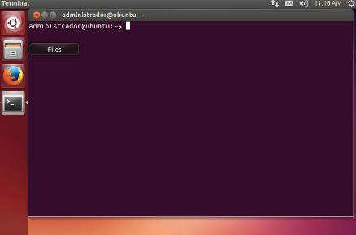
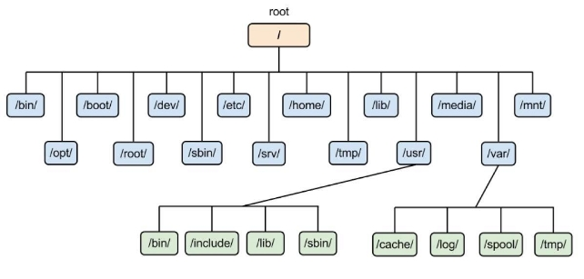
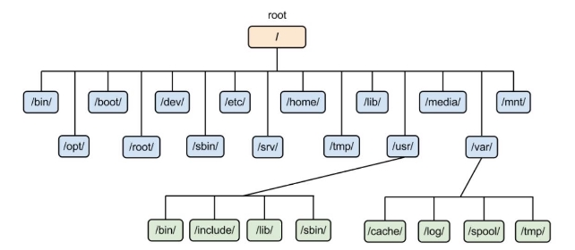

---
titulo: Linux, introduccion y directorios
author: Carolina Fernandez Serna
fecha: 11/03/2024
output: pdf_document
---

# Tema 4 
<!-- portada  con imágenes-->

<!--Esto es una caja de anotaciones-->

> ### Esta es solo una prueba de documentación

## **Linux - Introducción y Directorios**
<!-- indice -->
### *Contenido* 
<!-- creación de enlaces en el mismo documento-->
[ 1  Introducción al sistema operativo Linux. .................................................................................... 3 ](#_page3_x54.00_y78.92)

[1.1  ¿Qué es UNIX?................................................................................................................... 3 ](#_page3_x54.00_y106.92)

[ 2  Interfaz de usuario. ..................................................................................................................... 4 ](#_page3_x54.00_y708.92)

[ 3  Discos y Particiones. .................................................................................................................. ]

[6 (#_page5_x468.00_y542.92)]

1. [Introducción a las Particiones de disco. ............................................................................... 6 ](#_page5_x54.00_y585.92)
2. [Nomenclatura de las particiones en Linux. .......................................................................... 7 ](#_page7_x54.00_y617.92)
3. [Swap................................................................................................................................... 9 ](#_page9_x54.00_y630.92)

[ 4  Estructura de Ficheros de Linux. .............................................................................................. 10 ](#_page10_x54.00_y490.92)

1. [Características del sistema de archivos en Linux. .............................................................. 15 ](#_page11_x54.00_y331.92)
1. [Tipos de sistemas de archivos en Linux. ............................................................................ 16 ](#_page12_x54.00_y264.92)
1. [Directorios más importantes en Linux. .............................................................................. 17 ](#_page13_x54.00_y125.92)

[ 5  Gestión del Sistema Operativo Linux. ...................................................................................... 18 ](#_page14_x54.00_y335.92)

[5.1  Rutas Absolutas y Relativas .............................................................................................. 20 ](#_page15_x54.00_y489.92)

[ 6  Comandos Básicos. .................................................................................................................. 21 ](#_page16_x54.00_y343.92)

1. [Comandos para manipular Directorios. ............................................................................. 21 ](#_page17_x54.00_y56.92)
1. [Comandos para manipular Ficheros. ................................................................................. 23 ](#_page18_x54.00_y367.92)
1. [Comandos para paginar, visualizar y editar Ficheros. ........................................................ 31 ](#_page26_x54.00_y418.92)
1. [Comandos para hacer búsquedas de Ficheros y Patrones. .................................................. 36 ](#_page31_x54.00_y641.92)
1. [Comandos para Comprimir y Agrupar ficheros. ................................................................ 39 ](#_page35_x54.00_y288.92)

[ 7  Manejo avanzado de la Shell. ................................................................................................... 45 ](#_page41_x54.00_y56.92)

1. [Variables de Entorno. ........................................................................................................ 45 ](#_page41_x54.00_y78.92)
1. [Metacarácteres. ................................................................................................................. 47 ](#_page43_x54.00_y223.92)
1. [Añadir o Concatenar Comandos. ....................................................................................... 47 ](#_page43_x54.00_y653.92)

[ 8  Expresiones Regulares. ............................................................................................................ 48 ](#_page46_x54.00_y56.92)

[ 9  Más comandos útiles. ............................................................................................................... 48 ](#_page49_x54.00_y284.92)

**OBJETIVOS** 
<!-- lista numerada -->
- 1. Identificar e instalar el sistema operativo Linux Ubuntu. 
- 2. Identificar y personalizar los elementos de la interfaz gráfica de Linux. 
- 3. Iniciar y apagar el sistema operativo. 
- 4. Conocer y personalizar las ventanas y escritorio. 
- 5. Identificar y utilizar menús, barras y cuadros de diálogo. 
- 6. Realizar operaciones con iconos. 
- 7. Ajustar las preferencias de escritorio. 

# 1      Introducción al sistema operativo Linux.

**1.1   ¿Qué es UNIX?** 

El sistema operativo UNIX empezó a desarrollarse por universitarios estadounidenses en la década de los 70, escrito en lenguaje C. 

Existe una gran variedad de versiones de UNIX para diferentes plataformas –tanto para ordenadores personales  y  estaciones  de  trabajo,  como  para  servidores  y  miniordenadores–,  tanto  de  libre distribución (Linux, Minix) como comerciales (Solaris, AIX, HP-UX, ...). 

Linux es un UNIX de libre distribución – desarrollado inicialmente por el programador finlandés Linus  Torvalds–,  que  ha  crecido  rápidamente  gracias  a  la  ayuda  de  una  gran  cantidad  de programadores comunicados por Internet, y que han desarrollado y probado muchos componentes para el sistema. 

En la actualidad existen varias distribuciones de Linux: RedHat, Slackware, Debian, etc. Algunas de ellas han sido desarrolladas no sólo para ordenadores personales –basados en procesadores Intel o compatibles–, sino también para máquinas con procesadores Sparc o PowerPC. 

Antes  de  comenzar  a  centrarnos  con  el  Linux, conviene  conocer  algunas  de  las  características fundamentales del UNIX (y, por extensión, del propio Linux):   
<!-- lista no numerada -->
* Sistema operativo **multiusuario y multitarea**. 
* Sistema operativo **basado en capas**. 
* El almacenamiento en disco se organiza en **sistemas de archivos**. 
* Los **espacios de paginación** permiten incrementar la memoria disponible. 
* Trabaja con el protocolo de **red TCP/IP**. 
* Cada usuario tiene una  **cuenta**  cuyas características  y permisos vienen definidos por el **administrador (root).** 
* El usuario se comunica con el sistema mediante el **intérprete de mandatos**. 
* Cada  programa  en  ejecución  consta  de  uno  o  más  **procesos**, con identificador único y con una relación  de **parentesco**.  

El sistema operativo consta de estos dos componentes:  

- **Shell:** Permite al usuario interactuar con el Sistema  Operativo.  
- **Núcleo**: Interactúa con el hardware.**  

 **3   Interfaz de usuario.**  

Como ya hemos visto el usuario puede comunicarse con el  sistema operativo a través de la interfaz, y podemos encontrarla de dos tipos: **modo texto o interfaz de línea de comandos o CLI** y **modo gráfico o GUI**. El primero de ellos se hace mediante comandos mientras que el segundo mediante el uso del ratón, iconos y ventanas. 

Es importante destacar que cuando hablamos de CLI o GUI nos estamos refiriendo a métodos de interacción, no a herramientas o programas informáticos. De hecho, a la herramienta que posibilita cualquier interacción con la máquina se conoce como **shell.** 

Una shell es una herramienta que acepta órdenes o instrucciones por parte del usuario y ejecuta operaciones. En Linux podemos interactuar con multitud de shells diferentes, tanto a nivel de interfaz de línea de comandos como a nivel de interfaz gráfica. 

**La Interfaz de Línea de Comandos o CLI.** 

La interfaz de línea de comandos, o CLI, por sus siglas en ingles (command-line interface) es un método de comunicación entre usuarios y máquina que acepta instrucciones del usuario a través de líneas de texto. 

Es el método que se utilizaba antes de la aparición de las interfaces gráficas o GUI, que sirvió para acercar la informática a la mayoría de la gente, ya que la interacción es mucho más amigable e intuitiva (a costa, obviamente, de una mayor complejidad y consumo de recursos). 

En Linux tenemos multitud de **shells** o interpretes diferentes. El más conocidos es **Bash**, debido a que es el que suele venir por defecto en la mayoría de distribuciones GNU/Linux, pero también destacan otros como Bourne shell (sh), Korn shell (ksh) o C shell (csh). 

**Bash.** 

Bash es una herramienta Open Source perteneciente al proyecto GNU, y que fue escrita por Brian Fox. Su nombre es el acrónimo de “Bourne-Again Shell”, en referencia a **Bourne shell (sh),** uno de los primeros interpetes de comandos de Unix. De hecho, Bash hereda muchas propiedades de otras shells como **sh, csh o zsh.** Actualmente es la interfaz de lineas de comandos predeterminada en la mayoría de distribuciones GNU/Linux así como en macOS. 

**Las Terminales TTY.** 

Las terminales TTY son las diferentes ventanas de terminal que permiten interactuar con el sistema a través del interprete de comandos, fuera del entorno gráfico. 

En la gran mayoría de distribuciones Linux existen un total de 7 pantallas TTY (6 en modo texto y una en modo gráfico), las cuales pueden usarse de manera simultanea. Para acceder a ellas pulsaremos Ctrl + Alt + Fx (de F1 a F6 para acceder a la terminal en modo texto y F7 para acceder al modo gráfico). 

**Los emuladores de Terminal.** 

Aparte de la interfaz de línea de comandos, que nos ofrece la shell a través de las diferentes terminales TTY, en Linux los propios entornos de escritorio también pueden utilizar la terminal a través de los emuladores de terminal o PTS. 

Un emulador de terminal es una aplicación que permite virtualizar un interprete de comandos pero dentro de la propia interfaz gráfica. La mayoría de entornos de escritorio en GNU/Linux incorpora su propio emulador de terminal. Tienen la ventaja de posibilitar la interacción a través de la línea de comandos, pero sin necesidad de salir del entorno gráfico. 

 **4  Discos y Particiones.** 

1. **Introducción a las Particiones de disco.** 

Cuando un disco sale de fábrica no tiene ningún tipo de estructura lógica. Mediante el particionado, se divide en partes y se asigna un tamaño y estructura a cada una de esas partes. 

Existen tres tipos diferentes de particiones: 

- **Particiones primarias**. Son divisiones crudas o primarias del disco, solo puede haber 4 o 3 y una extendida. Depende de una **tabla de particiones.** Un disco duro físico completamente formateado consiste, en realidad, de una partición primaria que ocupa todo el espacio del disco. Prácticamente, cualquier sistema operativo puede detectar este tipo de particiones primarias, y asignarles una unidad.  La partición primaria puede ser reconocida como una partición de arranque y puede contener un sistema operativo que realice el arranque del equipo. 

- **Partición extendida. También** conocida como partición secundaria, es otro tipo de partición que actúa como una primaria, sin llegar a serlo. Fue ideada para romper la limitación de 4 particiones primarias en el disco físico. Solo puede existir una partición de este tipo por disco y sirve para contener otras particiones lógicas. 
- **Partición lógica**. Ocupa una porción de la partición extendida o la totalidad de la misma y se formatea con un tipo especifico de sistema de archivo. 

Disco duro con 3 particiones primarias, una extendida y una lógica. 

Disco duro con 3 particiones primarias, una extendida y 4 unidades lógicas. 

1. **Nomenclatura de las particiones en Linux.** 
**
` `GNU/Linux usa un método lógico para nombrar las particiones y los discos. **Los discos se nombran con una letra:** 

2.  Los discos SCSI, SATA se denominan **/dev/sda, /dev/sdb**, etc. en el orden en que aparezcan el primer disco duro será **/dev/sda** [SCSI Disc **a**], sel segundo será **/dev/sdb** [SCSI Disc **b**], el tercero **/dev/sdc** [SCSI Disc **c**] 
3.  Anteriormente  para  los  **dispositivos  IDE  maestro  y  esclavo  primarios**  se  denominan  /d**ev/hda** y /**dev/hdb** respectivamente. En la interfaz secundaria, el maestro se denomina /**dev/hdc**  y  el  esclavo  se  denomina  **/dev/hdd.**  Si  nuestra  computadora  contienia  otras interfaces IDE los dispositivos se denominarán **/dev/hde, /dev/hdf**, etc. 
4.  Los CD-ROM SCSI se denominan **/dev/scd0**, **/dev/scd1**, siempre en el orden de aparición de los mismos en la cadena SCSI. 

Dentro de cada disco podemos particiones, **las particiones se nombran con un número**. De esta forma: 

- Para las particiones primarias, dado que pueden haber hasta cuatro particiones se reservan del 1 a 4. 
- Por  ejemplo  para  el  primer  disco  duro  las  particiones  primarías  serán:  **/dev/sda1, /dev/sda2,  /dev/sda3 y /dev/sda4.** 
- Las  particiones  del  segundo  disco  duro  serán:  **/dev/sdb1,   /dev/sdb2,   /dev/sdb3  y /dev/sdb4.** 
- A las particines extendidas se les asigna un número a partir de 5: **/dev/sda5,  /dev/sda6,  /dev/sdb5 y /dev/sdb6.** 

1. **Swap.** 

En informática, el espacio de intercambio es una zona del disco que se usa para guardar imágenes de los procesos que no han de mantenerse en memoria física. A este espacio se le suele llamar swap, del ingles “intercambiar”. 

**¿HACE FALTA SWAP?** 

La memoria de intercambio sirve como RAM adicional. Entonces, en un ordenador que ya tenga mucha memoria RAM ¿Hace falta swap?. 

Aunque puede funcionar perfectamente sin tener ningún área de intercambio, es muy recomendable crearla. 

La razón es que siempre es bueno quitar de la memoria los procesos poco usados, ya que eso permite usar la RAM para otras tareas. 

Un ejemplo: supongamos que un usuario abre en un programa que ejecuta un proceso muy grande, que le consume el 80% de la memoria RAM, y después, sin cerrarla, se pone a hacer varias búsquedas de ficheros por su disco duro. Si no puede llevar a disco ese proceso grande, quiere decir que ha de mantenerse en memoria física; por tanto, solo tendrá menos del 20 % de la memoria RAM, por lo que será poco eficiente. Con swap, se podría llevar a disco el proceso grande (o al menos una parte), hacer esas búsquedas usando mayor parte de la RAM y luego restaurar el proceso si hace falta. 

**TAMAÑO DEL ESPACIO DE INTERCAMBIO.** 

Ésta es una discusión típica entre los administradores de sistemas, y una duda común que sale durante la instalación de un sistema Linux. 

Hay una regla conocida que dice que “la swap ha de ser el doble de la memoria RAM instalada”, pero esto ya no es válido hoy en día. Esta regla funcionaba bien antes, cuando se compraba menos RAM de la que realmente se necesitaba, porque era muy cara. 

Actualmente esto es lo que se recomienda para la swap: 

- 1 GB de RAM o menos: la misma cantidad para la swap. 
- Entre 2 GB y 4 GB de RAM: la mitad para la swap. 
- Más de 4 GB de RAM: 2 GB de swap. 

 **5   Estructura de Ficheros de Linux.** 

Un sistema de archivos es el  modo en el que el sistema operativo organiza  los archivos en el dispositivo de almacenamiento (normalmente un disco duro), gestionando de manera que los datos estén de forma estructurada y libre de errores. 

Hemos de tener en cuenta que en Linux todo es un archivo, tanto el hardware como el software está almacenado como un archivo de texto. 

La estructura de archivos de Linux es una **estructura jerárquica** en forma de árbol invertido,**bajo el estándar FHS (Filesystem Hierarchy Standard).** 

El **directorio origen o raíz** se representa por **/** (barra inclinada) y bajo este se localizan todos los demás archivos accesibles en el sistema operativo. 

Por ejemplo, sin queremos acceder a un CDROM. Este es montado al sistema como un subdirectorio. En ese subdirectorio se localizará el contenido del dispositivo cuando se encuentre montado y no encontraremos nada en caso contrario. Para obtener la lista de dispositivos montados en el sistema, simplemente hacemos uso del comando mount en la consola. 

1. Características del sistema de archivos en Linux.** 

El sistema de archivos o file system de Linux permite al usuario crear, borrar y acceder a los archivos sin necesidad de saber el lugar exacto en el que se encuentran. 

**No existen unidades físicas, sino ficheros que hacen referencias a ellas**, integrados en la estructura de archivos como cualquier otro. 

El esquema del sistema de archivos de Linux está compuesto por: 

- **Bloque de carga o bloque cero.**  Ocupa  la parte del principio del sistema de archivos, normalmente en el primer sector, y puede contener el código de arranque. Esté código es un pequeño programa que se encarga de buscar el sistema operativo y cargarlo en memoria. 
- **Superbloque**. Contiene la información sobre el sistema de archivos (tamaño, total de archivos que puede contener, cuanto espacio queda libre, etc) 
- **Tabla de inodos**. Por cada archivo se realiza una entrada almacenando la información de éste, lo que se conoce como **inodo.**   Cada **inodo** guarda la siguiente información: 
- **Identificador del propietario del archivo.**  La posesión puede ser de un propietario individual o un grupo de propietarios, y define el conjunto de usuarios que tienen derecho de acceso al archivo. El superusuario tiene derecho de acceso a todos los archivos del sistema de archivos. 
- **Tipo de archivo.** 
- **Tiempos de acceso al archivo.** Estos campos dan información sobre la fecha de última modificación, ultimo acceso a él y última modificación de los datos del inodo.** 
- **Número de enlaces de archivo.** Representa el total de los nombres que el archivo tiene en la jerarquía de directorios.** 
- **Tamaño del archivo.** 
- **Área de datos.** Se almacenan los ficheros y directorios de nuestro sistema.** 

Un directorio no es más que un fichero que contiene los nombres de los ficheros (o directorios) que contiene junto con el número del **inodo** que contiene la información de cada uno de ellos.** 

2. **Tipos de sistemas de archivos en Linux.** 

Linux soporta una gran variedad de sistemas de ficheros, desde sistemas basados en discos, como puede ser **ext2, ext3, ext4, ReiserFS, XFS, JFS, UFS, ISO9660, FAT, FAT30 y NTFS,** a sistemas de ficheros que sirven para comunicar equipos en la red de diferentes sistemas operativos, como **NFS (**utilizado para compartir recursos entre equipos Linux) o **SMB (**entre máquinas Linux y Windows). 

Los sistemas de archivos indican el modo en que se gestionan los archivos dentro de las particiones. Según su complejidad, tienen características como previsión de apagones, posibilidad de recuperar datos, indexación para búsquedas rápidas, reducción de las fragmentación para agilizar la lectura de los datos, etc. Hay varios tipos, normalmente ligados a sistemas operativos concretos. A continuación se enumera los más representativos: 

- **FAT32:**  Es  el  sistema  de  archivos  tradicional  de  MS-DOS  y  las  primeras  versiones  de Windows.  Es  tremendamente  versátil  gracias  a  su  enorme  **compatibilidad  con prácticamente todos los dispositivos** y sistemas operativos, razón por la que la mayoría de unidades USB estarán  formateadas con él. Entre sus  **limitaciones**, sólo permite guardar **archivos de hasta 4 GB.** 
- **NTFS.** Es el nuevo sistema de Windows, muy estable. El problema es que es privativo, por lo que otros sistemas operativos no pueden acceder a él de manera transparente. Desde Linux solo se recomienda la lectura, siendo la escritura a estas particiones un poco arriesgada. 
- **Ext3:** es la versión mejorada de ext2, con previsión de pérdidas de datos por fallos del disco 
  - apagones.  En  contraprestación,  es  totalmente  imposible  recuperar  datos  borrados.  Es compatible con el sistema de archivos ext2.** 
- **Ext4.** Nace para implementar algunas características de ext3:** 
- Tasa de transferencia bastante superior a ext3. 
- Mejor rendimiento. 
- Sistemas de ficheros de mayor tamaño: permite tamaños de hasta 1 exabyte. 
- **ReiserFS:** Sistema de archivos para otras distribuciones Linux, que entre otras gestiona de manera muy eficiente archivos pequeños y permite **Journaling** que previene del riesgo de corrupción del sistema de archivos.** 
- **Swap:** como ya hemos visto es el sistema de archivos para la zona de intercambio de Linux.** 
3. **Directorios más importantes en Linux.** 

Veamos algunos de los directorios más importantes en Linux y lo que contienen: 

|**Directorio** |**Descripción breve.** |
| - | - |
|/ |
**Directorio raíz**  del** sistema  de ficheros. Denominado  directorio Root (No confundir con el usuario root). 

Solo el usuario Root tiene privilegios de escritura en este directorio. No es lo mismo /root que /, el primero es el home del usuario root, el segundo es la raíz de todos los archivos 
|
|/bin |**Comandos y programas esenciales** disponibles para todos los usuarios del sistema. |
|/boot |**Gestores de arranque.** |
|/dev |Contiene  los  **dispositivos  esenciales**  (no  solo  los  de  almacenamiento,  también  terminales, micrófonos, impresoras, etc). |
|/etc |Ficheros de **configuración del sistema**. El nombre proviene de “etcétera”. |
|/etc/network |Fichero de **configuración del servicio de red** |
|/home |**Directorios de los usuarios**, excepto el del superusuario (root). Estos directorios contienen los ficheros propios de un usuario. |
|/lib |Contiene  todas  las  **bibliotecas**  (mal  traducidas  como  librerías)  para  que  se  **ejecuten  los programas alojados** /bin y /sbin. |
|/media |Contiene las **unidades físicas que tenemos montadas**: discos duros, unidades DVD, pen drive, etc. |
|/mnt |Sistema de ficheros **montados temporalmente**. Es una directorio semejante a /media, que sirve para montar discos duros y particiones de forma temporal en el sistema. |
|/opt |Paquetes **software opcionales**, que pueden ser compartidos por los usuarios. Estas aplicaciones, utilizan el directorio de usuario para guardas sus configuraciones, y de esta forma, cada usuario puede tener una configuración diferente de la misma aplicación. |
|/proc |Ficheros de texto que identifican **procesos activos** en el sistema. |
|/root |**Directorio personal (home) del usuario root.** |
|/sbin |Sistema de binarios esencial**, comandos y programas exclusivos del superusuario** (root), por ejemplo: init, route). |
|/tmp |**Ficheros temporales** (véase también /var/tmp). |
|/usr |**Utilidades y programas generales de usuario**. Contiene programas de uso general para todos los usuarios. |
|/var |**Ficheros  variables**,  tales  como  logs,  archivos  spool,  bases  de  datos,  archivos  de  e-mail temporales, y archivos temporales en general. |

 **6   Gestión del Sistema Operativo Linux.** 

Para gestionar GNU/Linux, como ya hemos visto, podemos hacer uso de la interfaz gráfica y la interfaz de texto conocida como consola. 

Hace no mucho tiempo, toda la gestión del sistema operativo GNU/Linux se hacía a través de la consola haciendo uso de comandos. Al iniciar la consola mostrará el siguiente prompt: 

usuario@maquina : ~ $ 

Del prompt podemos obtener la siguiente información: 

- Usuario: EL usuario que está interactuando con la Shell. 
- Máquina: El nombre del PC que está utilizando. 
- ~ : Directorio, del sistema de archivos donde se encuentra el usuario. 
- $ o # : Indica si es un usuario normal ($), o es un usuario con privilegios (#). 

El programa que se ejecuta en Linux cada vez que un usuario se conecta y que le permite interactuar con el sistema se conoce como shell. Este es capaz de interpretar una gran gama de comandos y sentencias. Constituye a su vez un poderoso lenguaje de Scripting (programación). 

Existen muchos tipos de shells orientados a caracteres para Linux. Ejemplos: 

- ash: A shell 
- csh: C shell 
- bsh: Bourne Shell 
- bash: Bourne Again Shell. 

De los mencionados anteriormente bash es el más empleado en Linux. Este es uno de los más desarrollados y está portado para múltiples plataformas. Ofrece entre otras posibilidades las siguientes: 

- Auto completa durante la escritura. Al teclear uno o varios caracteres se puede pulsar TAB con el objetivo de que en caso de que pueda completarse de forma unívoca un comando, nombre de fichero o una variable (dependerá del contexto), complete de forma automática (se escriba el resto de una palabra). Si existen varias posibilidades para completar la palabra, se oirá un sonido y volviendo a pulsar TAB se mostrará en pantalla las posibilidades existentes. 
- Historial de comandos. Esta es una facilidad de muchos shells que permite el movimiento a través de los N últimos comandos ejecutados, en la sesión actual o en las anteriores. N por defecto es 1000, pero puede modificarse. Para moverte arriba y abajo se suele usar los cursores. 
- Poderosa estructura de control para realizar scrips. (Procesos por lotes). Se pueden usar instrucciones if, for, while, select, etc. 
- Definición de funciones y alias para comandos. Las funciones permiten definir subrutinas programadas usando el lenguaje de bash y los alias, asociar nombres a llamadas a comandos con ciertas opciones y argumentos de forma más nemotécnica y abreviada. 
1. ** 
2. **Rutas Absolutas y Relativas** 

Para indicar la ubicación en disco de un fichero hay que indicar la lista de directorios que contienen al fichero. Es decir, un fichero puede estar dentro de un directorio que a su vez está dentro de otro y así varios. En esta lista, que denominaremos ruta de acceso, cada directorio está separado del siguiente directorio por el signo / , y sin dejar espacios en blanco. 

Para facilitar las cosas existen ciertos directorios especiales: 

- /  Es el directorio raíz. El superior de todos. 
- .   Es el directorio activo. En el que nos encontramos en un momento dado. 
- ..   Es el directorio superior al que nos encontramos. 

Hay dos formas de expresar la ruta de un fichero, **absoluta y relativa.** 

Una ruta absoluta es aquella que parte del directorio raíz. Las rutas absolutas son válidas en cualquier caso. Si establecemos como ejemplo paralelo la dirección de la vivienda, la dirección absoluta incluye la calle y el número de la vivienda, de forma única e independiente. 

Una ruta relativa, es una ruta que parte del directorio actual como origen. Esta ruta sólo es válida desde un directorio actual concreto , es decir es relativa a un directorio. Si seguimos el ejemplo que pusimos para la dirección de una vivienda, una ruta relativa es como si te indicaran "dos casas más allá de cierta esquina". 

Observamos como la dirección "dos casas más allá una cierta esquina" es sólo válida para una calle, y esa misma dirección referida a otra calle sería otro inmueble distinto. 

Ejemplo: 

**El archivo fich.txt se encuentra en /home/user/docu/text** 

**Si estás en /home/user/  la ruta absoluta hacia fich.txt es   /home/user/docu/text/fich.txt** 

**Si estás en /home/user/  la ruta relativa hacia fich.txt es  docu/text/fich.txt** 

**Si estás en /home/user/Escritorio  la ruta relativa hacia fich.txt es  ../docu/text/fich.txt** 

` `**7**  

 **8   Comandos Básicos.** 

Los comandos son pequeños programas del sistema operativo, cuya sintaxis es la siguiente: comando parámetros 

**comando paramétros opciones** 

Reglas: 

- Los comandos se escriben en minúsculas. 
- Entre el comando y cada uno de los parámetros hay un espacio en blanco. 
- Las opciones se escriben poniendo un guión delante y se pueden agrupar poniendo un único guion delante de ellas. 

En las siguientes secciones mencionaremos y describiremos la utilidad de un grupo de comandos básicos para interactuar con un sistema Linux. 

1. **Comandos de ayuda de shell de Linux.** 

man

|**Comando** |**Función** |
| - | - |
|man |El comando man permite acceder a la ayuda de cualquier comando.|

|**Ejemplos** |**Resultado** |
| - | - |
|$ man ls|Nos devuelve el manual del comando ls. |

1. **Comandos para manipular Directorios.** 

pwd

|**Comando** |**Función** |
| - | - |
|pwd |El comando pwd indica el camino absoluto del directorio actual en el que nos encontramos actualmente |

|**Ejemplos** |**Resultado** |
| - | - |
|$ pwd |Nos devuelve algo como      **/home/alumno/doc** |

cd

|**Comando** |**Función** |
| - | - |
|Cd |El comando cd se utiliza para cambiar el directorio actual |
|**Sintaxis** |**cd [directorio]** |

|**Ejemplos** |**Resultado** |
| - | - |
|$ cd /home|Cambia al directorio  **/home** |
|**$ cd** |Cambia al directorio base (home) del usuario |
|$ cd ~ |Cambia al directorio home del usuario actual |
|$ cd .. |Cambia al directorio superior al que nos encontramos. |

mkdir

|**Comando** |**Función** |
| - | - |
|Mkdir |El comando mkdir se utiliza para crear directorios. |
|**Sintaxis** |**cd [opciones] [directorio]** |

|**Opciones** |**Explicación.** |
| - | - |
|-p |Crea los directorios intermedios si no existen. |

|**Ejemplos** |**Resultado** |
| - | - |
|**$ mkdir datos** |Crea en el directorio actual el directorio **datos** |
|**$ mkdir /bin** |Crea el directorio bin en el raiz |
|**$ mkdir -p docs/linuxdocs/howtos/pdf** |Se crea los directorios intermedios si no existen. |

rmdir

|**Comando** |**Función** |
| - | - |
|Rmdir |El comando rkdir se utiliza para borrar directorios. |
|**Sintaxis** |**rmdir [opciones] [directorio]** |

|**Opciones** |**Explicación.** |
| - | - |
|-p |Borra los directorios intermedios si están vacios.|
|-v |Informa de todos los borrados que han sido existosos. |

|**Ejemplos** |**Resultado** |
| - | - |
|**$ rmdir datos** |Borra el directorio datos que hay en el directorio actual|
|**$ rmdir /bin** |Borra el directorio bin del raiz |
|**$ rmdir -p docs/linuxdocs/howtos/pdf** |Borra el directorio docs/linuxdocs/howtos/pdf y todos los directorios intermedios si  están vacios. |

1. **Comandos para manipular Ficheros.** 

ls

|**Comando** |**Función** |
| - | - |
|Ls |Permite listar el contenido de un directorio. |
|**Sintaxis** |**ls [opciones] [directorio]** |

|**Opciones** |**Explicación** |
| - | - |
|-l |Muestra la salida en formato largo. |
|-R |Lista recursivamente un directorio. |
|-a |Lista además los ficheros ocultos (sus nombres comienzan con punto) |
|-h |Muestra el tamaño de los ficheros en forma más legible |
|-i |Muestra el inodo de cada elemento. |

